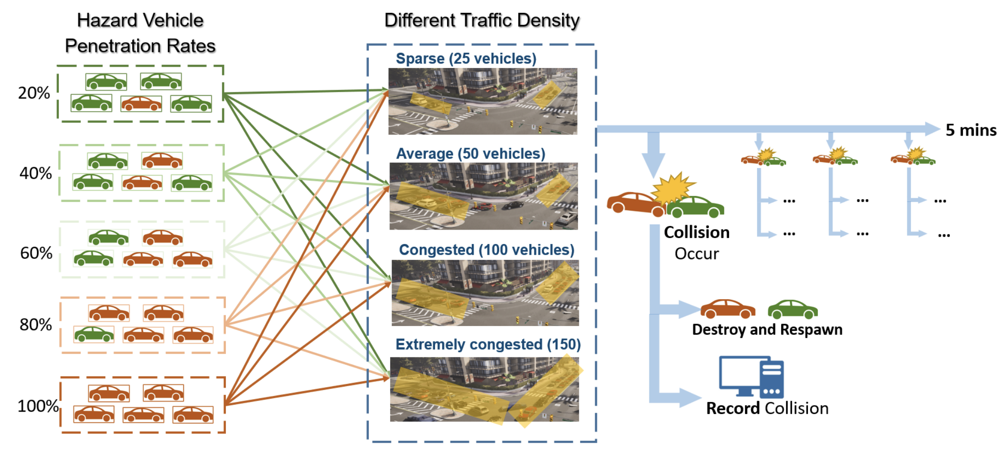

# Humanoid Scenario Generation (HSG) in CARLA


This repository contains the code for the paper [Study on the Impacts of Hazardous Behaviors on Autonomous Vehicle Collision Rates Based on Humanoid Scenario Generation in CARLA](https://arxiv.org/abs/2307.10229). If you find our code or papers useful, please cite:

```bibtex
@misc{mo2023study,
      title={Study on the Impacts of Hazardous Behaviors on Autonomous Vehicle Collision Rates Based on Humanoid Scenario Generation in CARLA}, 
      author={Longfei Mo and Min Hua and Hongyu Sun and Hongming Xu and Bin Shuai and Quan Zhou},
      year={2023},
      eprint={2307.10229},
      archivePrefix={arXiv},
      primaryClass={cs.RO}
}
```

## Contents

1. [Setup](#setup)
2. [Tutorials](#dataset-and-training)
3. [Evaluation](#evaluation)


## Setup

Clone the repo, setup CARLA 0.9.14, and build the conda environment:

```Shell
https://github.com/Longfei0/HSG
cd HSG
chmod +x setup_carla.sh
./setup_carla.sh
conda env create -f environment.yml
conda activate hsg
```

## Tutorials
The Following five examples scripts in this repo shows the running pattern of humanoid hazard vehicles: speeding, impeding, crimping, drunk&drug and distracted respectively. Each hazard model is customizable by modifying related parameters (e.g., `--R` and `--Dist` represent the speed ratio and following distance of speeding and impeding hazard vehicles). More details of the customizing parameters can be found in the [related paper]((https://arxiv.org/abs/2307.10229)). 

#### Speedind:

```Shell
python scripts/Hazard1_speeding.py --R 1.5 --Dist 1.5 -t 1
```

#### Impeding:

```Shell
python scripts/Hazard2_impeding.py --R 0.5 --Dist 6 -t 1
```

#### Crimping :

```Shell
python scripts/Hazard3_crimping.py --d_offset 1.7 --t_next [2,10] -t 1
```

#### Drunk&drug :

```Shell
python scripts/Hazard4_drunk\&drug.py --R_s 1.5 --R_i 0.5 --D_s 1.5 --D_i 6 --t_next [4, 10] --R_red 0.5 -t 1
```

#### Distracted:

```Shell
python scripts/Hazard5_distracted.py --t_loss [1,3] --t_interval 30 -t 1
```

In addition,  `-t` decides the total duration of each simulation running by each script, as `--interval_factor`determind the sampling intervals for recording driving data (e.g., speed, following distance) in each simulation. 

## Evaluation

This work evaluation the model by testing the collision rate of traffic. More concretely, we will increase the percentage of humanoid hazard vehicle in virtual environment incrementally, and the resulting change in collision rate is then recorded. The flowchart for this evaluation is shown below：




Run the following scripts to start an experiment simulation:

```shell
python scripts/HSG_traffic_experiment.py --debug -t 5 -nh 2 -n 50
```

In this program, the following parameters need to be clarified:

`--debug`: To set a free camera view(spectator) for debug, otherwise the camera be fixed on the top view of each vehicle.

`-n`: To set the total number of vehicles in the simulation.

`-t`: To set the total simulation time of this experiment.

`-nh`: To set the number of each kind of HHV (humanoid hazard vehicles) in 5 patterns. Since all kinds of HHV are evenly distributed, the total number of HHV = nh * 5.


## License 

#### Self licenses

This repository is distributed under MIT License.

#### Dependency and Integration licenses

[CARLA specific code](https://github.com/carla-simulator/carla) is distributed under MIT License.
